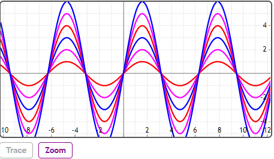

## 双模运算符

双模运算符用于访问列表或矩阵中的索引。列表是以1为索引的，因此使用单模运算符可能会导致边界错误，因为1%1是0，而1%%1是1。


## 举例

[在Mathstudio上浏览](http://mathstud.io/?input[0]=Y29sb3JzPVtyZWQsbWFnZW50YSxibHVlXQ0KZm9yIGkgaW4gMS4uNg0KIFBsb3QoaSpzaW4oeCksIGNvbG9yPWNvbG9ycyhpICUlICRjb2xvcnMpDQplbmQ%3D&input[1]=WzEgJSUgMywgMiAlJSAzLCAzICUlIDMsIDQgJSUgMywgNSAlJSAzLCA2ICUlIDNd)


> ```math
> colors=[red, magenta, blue]
> for i in 1..6
>   Plot(i*sin(x), color=colors(i %% $colors)
> end
> ```
> 

>   ```math
>   [1 %% 3, 2 %% 3, 3 %% 3, 4 %% 3, 5 %% 3, 6 %% 3]
>   ```
>   $[1,2,3,1,2,3]$

