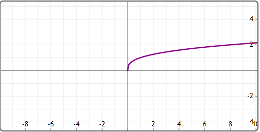
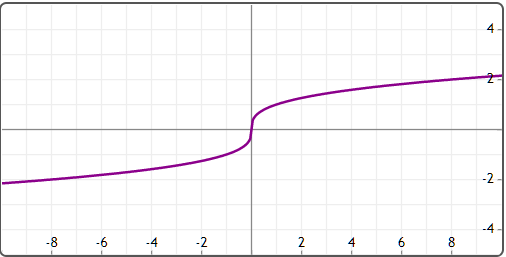
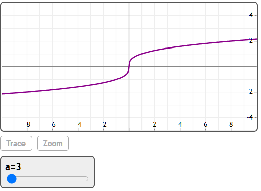

## 双幂运算符

双幂运算符(^^)会返回实值根。

## 举例

[在Mathstudio上浏览](http://mathstud.io/?input0=KC04KV4oMS8zKQ%3D%3D&amp;input1=KC04KV5eKDEvMyk%3D&amp;input2=UGxvdCh4XigxLzMpKQ%3D%3D&amp;input3=UGxvdCh4Xl4oMS8zKSk%3D&amp;input4=U2xpZGVyKGEsMywxMSwyKQ0KUGxvdCh4Xl4oMS9hKSk%3D")

> ```math
> (-8) ^ (1/3)
> ```
>
> $1 + 1.732050807569i$

> ```math
> (-8) ^^ (1/3)
> ```
>
> $ - 2$

> ```math
> Plot(x^(1/3))
> ```
> 

> ```math
> Plot(x^^(1/3))
> ```
> 

> ```math
> Slider(a, 3, 11, 2)
> Plot(x^^(1/a))
> ```
> 

