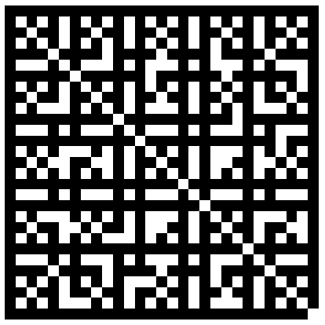
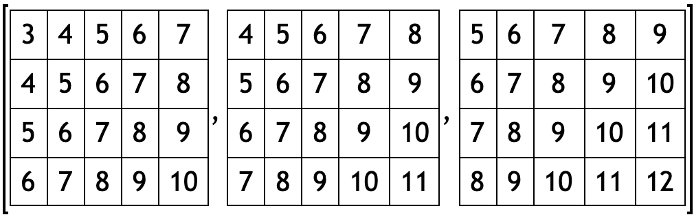

### for循环

遍历列表(list)、矩阵(matrix)或区间(range)。

### 示例

[在MathStudio中浏览](http://mathstud.io/?input[0]=bnVtYmVycyA9IDE6MTANCnN1bSA9IDANCmZvciBudW1iZXIgaW4gbnVtYmVycw0KIHN1bSArPSBudW1iZXINCmVuZA0Kc3Vt&input[1]=c3VtID0gMA0KZm9yIGkgaW4gMS4uMTANCiBzdW0gKz0gaQ0KZW5kDQpzdW0%3D&input[2]=c3VtID0gMA0KZm9yIGkgaW4gMS4uMTAgLT4gMg0KIHN1bSArPSBpDQplbmQNCnN1bQ%3D%3D&input[3]=ZGF0YSA9IEBbMjksIDI5XQ0KZm9yIHJvdyBpbiAxLi4yOQ0KIGZvciBjb2x1bW4gaW4gMS4uMjkNCiAgZGF0YShyb3csY29sdW1uKSA9IGdjZChyb3csY29sdW1uKSA%2BIDENCiBlbmQNCmVuZA0KSW1hZ2VQbG90KGRhdGEp&input[4]=ZGF0YSA9IEBbMjksIDI5XQ0KZm9yIFtyb3csIGNvbHVtbl0gaW4gZGF0YQ0KIGRhdGEocm93LGNvbHVtbikgPSBnY2Qocm93LGNvbHVtbikgPiAxDQplbmQNCkltYWdlUGxvdChkYXRhKQ%3D%3D&input[5]=bWF0cmljZXMgPSBAWzMsNCw1XQ0KZm9yIGkgaW4gMS4uMw0KIGZvciBqIGluIDEuLjQNCiAgZm9yIGsgaW4gMS4uNQ0KICAgbWF0cmljZXMoaSxqLGspID0gaSArIGogKyBrDQogIGVuZA0KIGVuZA0KZW5kDQptYXRyaWNlcw%3D%3D&input[6]=bWF0cmljZXMgPSBAWzMsNCw1XQ0KZm9yIFtpLCBqLCBrXSBpbiBtYXRyaWNlcw0KIG1hdHJpY2VzKGksaixrKSA9IGkgKyBqICsgaw0KZW5kDQptYXRyaWNlcw%3D%3D)

### 遍历列表

> ```math
> numbers = 1:10
> sum = 0
> for number in numbers
>  sum += number
> end
> sum
> ```
>
> $55$

### 遍历区间

> ```math
> sum = 0
> for i in 1..10
>  sum += i
> end
> sum
> ```
>
> $55$

### 使用箭头操作符更改区间的步长

> ```math
> sum = 0
> for i in 1..10 -> 2
>  sum += i
> end
> sum
> ```
>
> $25$

### 使用嵌套循环遍历矩阵

> ```math
> data = @[29, 29]
> for row in 1..29
>  for column in 1..29
>   data(row, column) = gcd(row, column) > 1
>  end
> end
> ImagePlot(data)
> ```



### 使用单层循环遍历矩阵

> ```math
> data = @[29, 29]
> for [row, column] in data
>  data(row, column) = gcd(row, column) > 1
> end
> ImagePlot(data)
> ```
>
> 

### 使用嵌套循环遍历多个矩阵

> ```math
> matrices = @[3, 4, 5]
> for i in 1..3
>  for j in 1..4
>   for k in 1..5
>    matrices(i, j, k) = i + j + k
>   end
>  end
> end
> matrices
> ```
>
> 

### 使用单层循环遍历多个矩阵

> ```math
> matrices = @[3, 4, 5]
> for [i, j, k] in matrices
>  matrices(i, j, k) = i + j + k
> end
> matrices
> ```
>
> 
