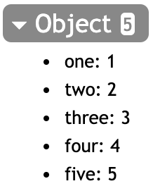
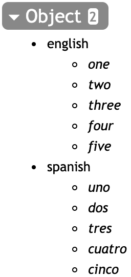

### 对象

对象是命名元素的有序集合。

点运算符(.)是访问对象中命名元素的一种缩写形式。

### 示例

[在MathStudio中浏览](http://mathstud.io/?input[0]=W29uZT0xLHR3bz0yLHRocmVlPTMsZm91cj00LGZpdmU9NV0%3D&input[1]=bnVtYmVycz1bb25lPTEsdHdvPTIsdGhyZWU9Myxmb3VyPTQsZml2ZT01XQ0KbnVtYmVycyhvbmUp&input[2]=W251bWJlcnMub25lLCBudW1iZXJzLnR3bywgbnVtYmVycy50aHJlZSwgbnVtYmVycy5mb3VyLCBudW1iZXJzLmZpdmVd&input[3]=bnVtYmVycz1bZW5nbGlzaD1bb25lLHR3byx0aHJlZSxmb3VyLGZpdmVdLHNwYW5pc2g9W3Vubyxkb3MsdHJlcyxjdWF0cm8sY2luY29dXQ%3D%3D&input[4]=bnVtYmVycyhlbmdsaXNoLCA0KQ%3D%3D&input[5]=bnVtYmVycyhzcGFuaXNoLCA0KQ%3D%3D&input[6]=bnVtYmVycyhlbmdsaXNoLCAzKQ%3D%3D)

> ```math
> [one=1, two=2, three=3, four=4, five=5]
> ```
>
> 

> ```math
> numbers = [one=1, two=2, three=3, four=4, five=5]
> numbers(one)
> ```
>
> $1$

> ```math
> [numbers.one, numbers.two, numbers.three, numbers.four, numbers.five]
> ```
>
> **[1, 2, 3, 4, 5]**

### 嵌套列表

> ```math
> numbers = [english=[one, two, three, four, five], spanish=[uno, dos, tres, cuatro, cinco]]
> ```
>
> 

> ```math
> numbers(english, 4)
> ```
>
> ***four***

> ```math
> numbers(spanish, 4)
> ```
>
> ***cautro***

> ```math
> numbers(english, 3)
> ```
>
> ***three***
