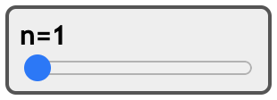
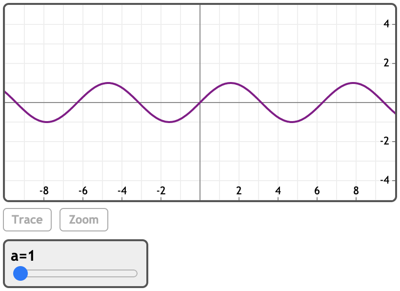
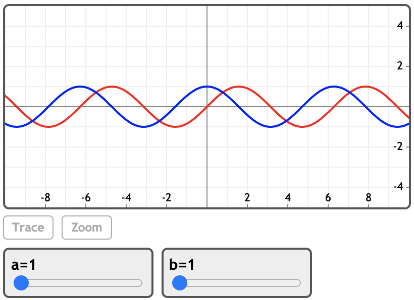

### 变量控件

MathStudio可以创建几种以交互方式更改变量的控件。

### 例子

[在MathStudio中浏览](http://mathstud.io/?input[0]=U2xpZGVyKG4sIDEsIDUwKQ0KRXhwYW5kKChhK2IpXm4p&input[1]=U2xpZGVyKGEsIDEsIDEwLCAwLjEpDQpQbG90KHNpbihhKngpKQ%3D%3D&input[2]=U2xpZGVyKFthLGJdLCAxLCAxMCwgMC4xKQ0KUGxvdChzaW4oYSp4KSwgY29sb3I9cmVkKQ0KUGxvdChjb3MoYip4KSwgY29sb3I9Ymx1ZSk%3D)

> ```math
> Slider(n, 1, 50)
> ```
>
> ***a + b***
>
> 

> ```math
> Slider(a, 1, 10, 0.1)
> Plot(sin(a * x))
> ```
>
> 

> ```math
> Slider([a, b], 1, 10, 0.1)
> Plot(sin(a*x), color=red)
> Plot(cos(b*x), color=blue)
> ```
>
> 
