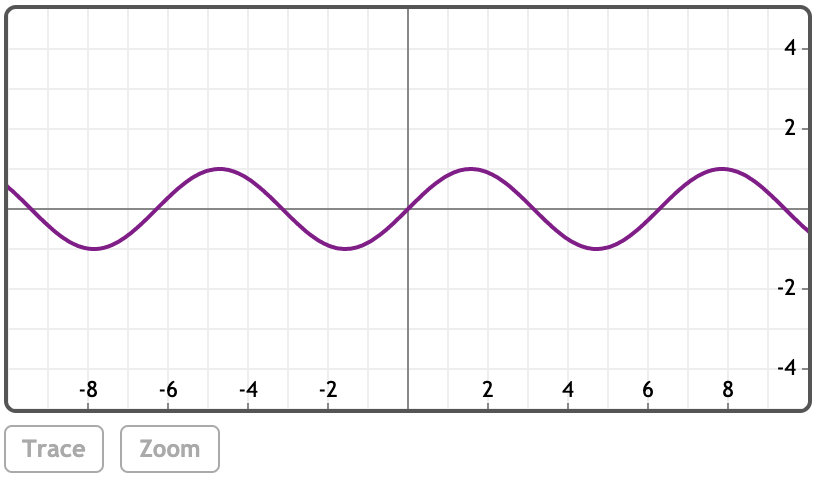
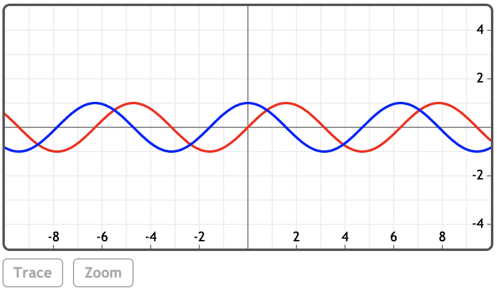
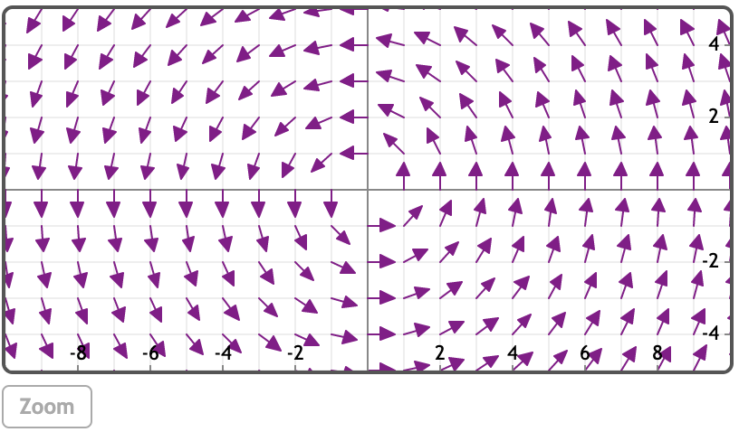
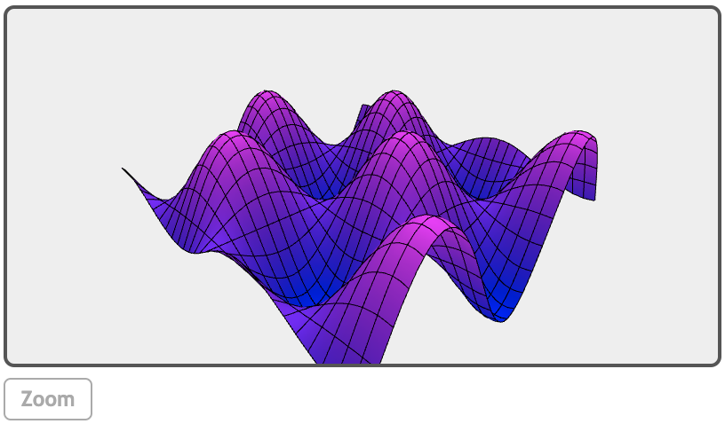

### 介绍
MathStudio是一款可以用于iPhone，iPad，Apple Watch，Mac 和浏览器上的计算软件。

### 例子
[在MathStudio中浏览](http://mathstud.io/?input[0]=MSsyKzMrNCs1&input[1]=NiE%3D&input[2]=eCt4K3g%3D&input[3]=RXhwYW5kKChhK2IpXjEwKQ%3D%3D&input[4]=RmFjdG9yKHheNCs1eF4yLTYp&input[5]=QXBhcnQoKHheMikvKHheMisxKV4yKQ%3D%3D&input[6]=UGxvdChzaW4oeCkp&input[7]=UGxvdChzaW4oeCksIGNvcyh4KSwgY29sb3I9W3JlZCxibHVlXSk%3D&input[8]=VmVjdG9yUGxvdCgteSwgeCk%3D&input[9]=UGxvdDNEKDJjb3MoeCkqc2luKHkpKQ%3D%3D&input[10]=M0BtaWxlcyAtPiBAa2lsb21ldGVycw%3D%3D&input[11]=QGN1cHMgLT4gQHRhYmxlc3Bvb25z&input[12]=QG1lZ2FieXRlcyAtPiBAYnl0ZXM%3D&input[13]=MTBAbGl0ZXJzIC0%2BIEBnYWxsb25z)

### 基本运算

> ```math
> 1 + 2 + 3 + 4 + 5
> ```
>
> $15$

> ```math
> 15!
> ```
>
> $720$

### 代数运算

> ```math
> x + x + x
> ```
>
> $3x$

> ```math
> Expand((a + b)^10)
> ```
>
> $a^{10}+b^{10}+10 a^{9} b+10 a b^{9}+45 a^{8} b^{2}+45 a^{2} b^{8}+120 a^{7} b^{3}+120 a^{3} b^{7}+210 a^{6} b^{4}+210 a^{4} b^{6}+252 a^{5} b^{5}$

> ```math
> Factor(x^4 + 5x^2 - 6)
> ```
>
> $(x-1)(x+1)(x^2+6)$

> ```math
> Apart((x^2) / (x^2 + 1)^2)
> ```
>
> $-\frac{1}{(x^2+1)^2}+\frac{1}{x^2+1}$

### 绘图

> ```math
> Plot(sin(x))
> ```
>
> 

> ```math
> Plot(sin(x), cos(x), color=[red, blue])
> ```
>
> 

> ```math
> VectorPlot(-y, x)
> ```
>
> 

> ```math
> Plot3D(2cos(x) * sin(y))
> ```
>
> 

### 单位换算

> ```math
> 3@miles -> @kilometers
> ```
>
> **4.83km**

> ```math
> @cups -> @tablespoons
> ```
>
> **16tbsp**

> ```math
> @megabyets -> @bytes
> ```
>
> **1 048 576byets**

> ```math
> 10@liters -> @gallons
> ```
>
> **2.64gallons**