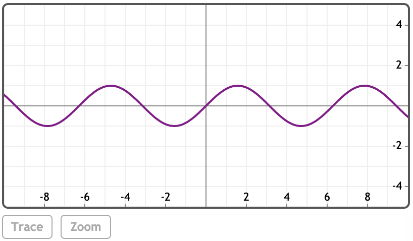
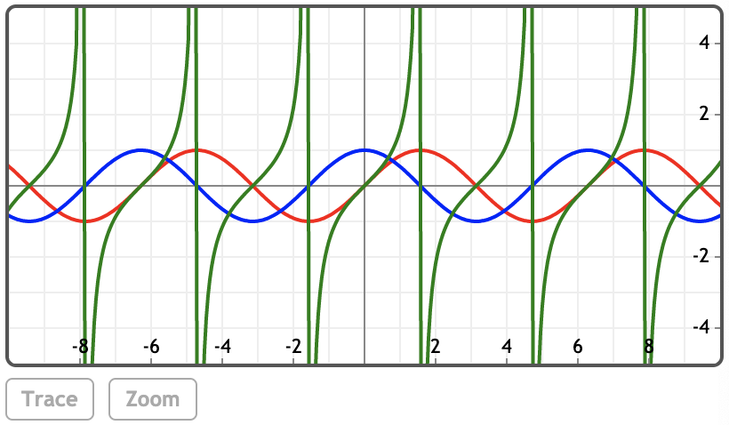

### 三角函数

**基础或圆函数**

sin(z), cos(z), tan(z)

**辅助函数**

csc(z), sec(z), cot(z)

### 举例
[在Mathstudio上浏览](http://mathstud.io/?input[0]=c2luKEBwaS80KQ%3D%3D&input[1]=c2luKDMwQGQp&input[2]=c2luKHgpL2Nvcyh4KQ%3D%3D&input[3]=c2luaCh4KS9jb3NoKHgp&input[4]=UGxvdChzaW4oeCkp&input[5]=UGxvdChzaW4oeCksY29zKHgpLHRhbih4KSxjb2xvcnM9W3JlZCxibHVlLGdyZWVuXSk%3D&input[6]=UGxvdChzaW5oKHgpKQ%3D%3D&input[7]=UGxvdChjb3NoKHgpKQ%3D%3D)

>    ```math
>    sin(@pi/4)
>    ```
>    $\frac{1}{\sqrt{2}}$
>    
>    0.707106781187


>    ```math
>    sin(30@d)
>    ```
>    $\frac{1}{2}$
>
>    0.5

### 减法
>    ```math
>    12 - 6
>    ```
>    ${\text{6}}$

>    ```math
>    5x - 2x
>    ```
>    ${\text{3}}x$

### 绘图
>    ```math
>    Plot(sin(x))
>    ```
>    

>    ```math
>    Plot(sin(x), cos(x), tan(x), colors=[red, blue, green])
>    ```
>    