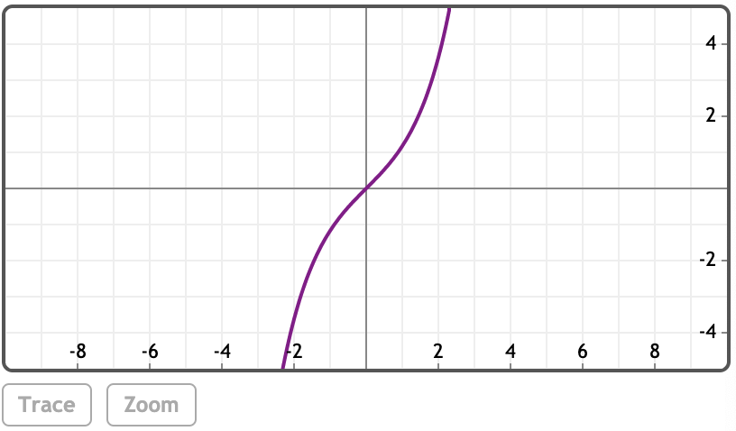

### 三角函数
**基础三角函数(圆函数)**
<br>sin(z), cos(z), tan(z)

**反三角函数**
<br>asin(z), acos(z), atan(z), atan(x, y)

(反三角函数是三角函数的反函数，定义参见：http://mathworld.wolfram.com/TrigonometricFunctions.html)

**辅助三角函数**
<br>csc(z), sec(z), cot(z)

**辅助反三角函数**
<br>acsc(z), asec(z), acot(z)

**双曲函数**
<br>sinh(z), cosh(z), tanh(z)

**反双曲函数**
<br>asinh(z), acosh(z), atanh(z)

**辅助双曲函数**
<br>csch(z), sech(z), coth(z)

**辅助反双曲函数**
<br>acsch(z), asech(z), acoth(z)

### 例子
[在MathStudio中浏览](http://mathstud.io/?input[0]=c2luKEBwaS80KQ%3D%3D&input[1]=c2luKDMwQGQp&input[2]=c2luKHgpL2Nvcyh4KQ%3D%3D&input[3]=c2luaCh4KS9jb3NoKHgp&input[4]=UGxvdChzaW4oeCkp&input[5]=UGxvdChzaW4oeCksY29zKHgpLHRhbih4KSxjb2xvcnM9W3JlZCxibHVlLGdyZWVuXSk%3D&input[6]=UGxvdChzaW5oKHgpKQ%3D%3D&input[7]=UGxvdChjb3NoKHgpKQ%3D%3D)

> ```math
> sin(@pi/4)
> ```
> $\frac{1}{\sqrt{2}}$
>
> 0.707106781187


> ```math
> sin(30@d)
> ```
> $\frac{1}{2}$
>
> 0.5

### 化简
> ```math
> sin(x) / cos(x)
> ```
> $tan(x)$

> ```math
> sinh(x) / cosh(x)
> ```
> $tanh(x)$

### 绘图
> ```math
> Plot(sin(x))
> ```
> 

> ```math
> Plot(sin(x), cos(x), tan(x), colors=[red, blue, green])
> ```
> 

### 双曲函数
> ```math
> Plot(sinh(x))
> ```
>
> 

> ```math
> Plot(cosh(x))
> ```
>
> 

### 引用（以下为英文资料）
[三角函数](http://mathworld.wolfram.com/TrigonometricFunctions.html)（来自Wolfram）
[反三角函数](http://mathworld.wolfram.com/InverseTrigonometricFunctions.html)（来自Wolfram）
[双曲函数](http://mathworld.wolfram.com/HyperbolicFunctions.html)（来自Wolfram）
[反双曲函数](http://mathworld.wolfram.com/InverseHyperbolicFunctions.html)（来自Wolfram）

[三角函数](http://en.wikipedia.org/wiki/Trigonometric_functions)（来自Wikipedia）
[双曲函数](http://en.wikipedia.org/wiki/Hyperbolic_function)（来自Wikipedia）

